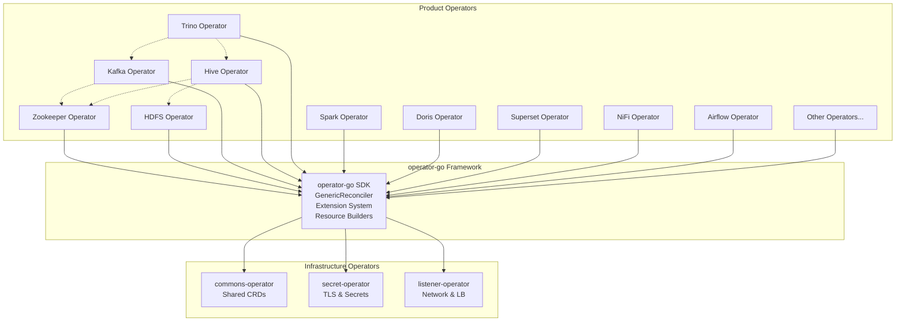
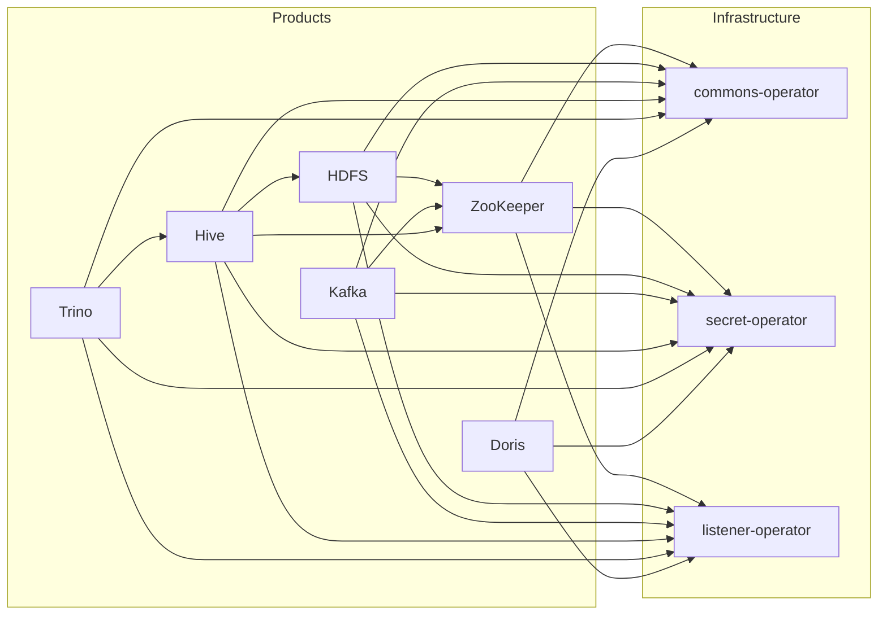
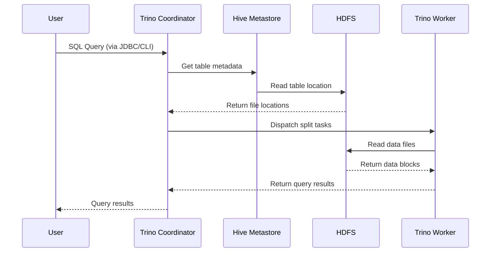

# Architecture

This document provides an overview of the Kubedoop Data Platform architecture, including component relationships, data flows, and design principles.

## High-Level Architecture



## Component Overview

### Infrastructure Operators

These operators provide shared capabilities that all product operators depend on:

| Operator | Purpose | Key Resources |
|----------|---------|---------------|
| **commons-operator** | Shared CRD definitions for the platform | `AuthenticationClass`, database connections |
| **secret-operator** | Provisions and injects TLS certificates and secrets into pods | TLS certs, Kerberos keytabs, passwords |
| **listener-operator** | Manages network listeners and load balancers | `ListenerClass`, `PodListeners` |

### Product Operators

Each product operator manages the full lifecycle of a specific data component:

| Category | Operators |
|----------|-----------|
| **Storage** | HDFS, Doris |
| **Messaging** | Kafka |
| **Query Engine** | Trino, Hive, Spark, Kyuubi |
| **Orchestration** | Airflow, DolphinScheduler |
| **Data Integration** | NiFi |
| **Visualization** | Superset |
| **Coordination** | ZooKeeper |

## Dependency Graph

### Operator Dependencies



**All product operators** depend on commons-operator, secret-operator, and listener-operator.

Additionally, some products have runtime dependencies on other products:
- **Kafka**, **Hive**, **HBase** require **ZooKeeper**
- **Hive** requires **HDFS** (or compatible storage)
- **Trino** can connect to **Hive** (for Hive catalog) and **Kafka** (for streaming)

## Data Flow Example

The following diagram illustrates a typical data flow for an interactive query using Hive + Trino:



### Service Discovery

Kubedoop uses a **Service Discovery ConfigMap** pattern for inter-component communication:
- Each product creates a ConfigMap with the same name as the cluster instance
- The ConfigMap contains connection details (hostnames, ports, credentials references)
- Other operators read this ConfigMap to configure connections

This eliminates the need for hard-coded addresses and enables dynamic reconfiguration.

## operator-go Framework

All Kubedoop operators are built on top of the [operator-go](https://github.com/zncdatadev/operator-go) framework, which provides:

### Architecture Layers

```
┌─────────────────────────────────────────────────┐
│              Product Operator                    │
│  ┌───────────────────────────────────────────┐  │
│  │           operator-go Framework            │  │
│  │  • GenericReconciler (Template Method)    │  │
│  │  • Extension System (Cluster/Role/Group)  │  │
│  │  • Resource Builders (STS/SVC/CM/PDB)     │  │
│  │  • Config Generation (XML/YAML/Props/Env) │  │
│  │  • Sidecar Management (Vector/JMX)        │  │
│  │  • CRD APIs (Auth/DB/Listener/S3)         │  │
│  └───────────────────────────────────────────┘  │
│  ┌───────────────────────────────────────────┐  │
│  │       controller-runtime (k8s sigs)       │  │
│  └───────────────────────────────────────────┘  │
└─────────────────────────────────────────────────┘
```

### Key Concepts

- **GenericReconciler**: Implements the reconciler loop using the Template Method pattern. Product operators provide role-specific handlers.
- **Extension System**: Provides hook-based customization at three levels:
  - *Cluster level*: Global settings applied to all roles
  - *Role level*: Settings applied to a specific role (e.g., all Kafka brokers)
  - *RoleGroup level*: Settings applied to a specific role group (e.g., broker group "high-memory")
- **Resource Builders**: Fluent API for building Kubernetes resources (StatefulSets, Services, ConfigMaps, PodDisruptionBudgets)
- **Config Generation**: Multi-format config file generation supporting XML, YAML, Properties, and environment variables

## Design Principles

### 1. Loose Coupling

Operators are independent and communicate only through Kubernetes resources (CRDs, ConfigMaps, Secrets). No operator directly calls another operator's API.

### 2. Declarative Configuration

All product configuration is done through YAML custom resources. Users describe the *desired state*, and operators reconcile toward that state.

### 3. Roles and Role Groups

Every product instance is composed of **roles** (logical process types), each of which can be further divided into **role groups** (configurable replicas). This model provides:
- Fine-grained resource allocation per process type
- Independent scaling and configuration per role group
- Gradual rollout through role-group-level updates

### 4. Unified Abstraction

Common concerns (TLS, authentication, logging, resource management) are handled by infrastructure operators and the operator-go framework. Product operators focus solely on product-specific logic.

### 5. Platform Portability

Kubedoop runs on any Kubernetes 1.26+ cluster, including managed services (Alibaba ACK, Tencent TKE), lightweight distributions (K3s, MicroK8s), and on-premises deployments.
