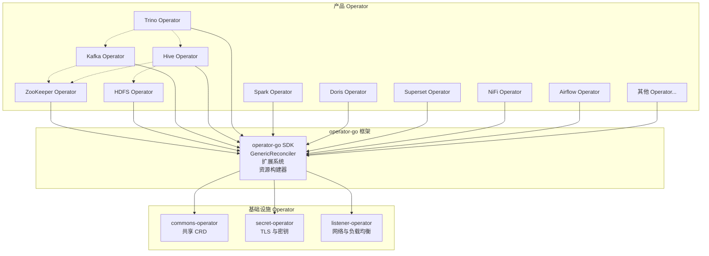
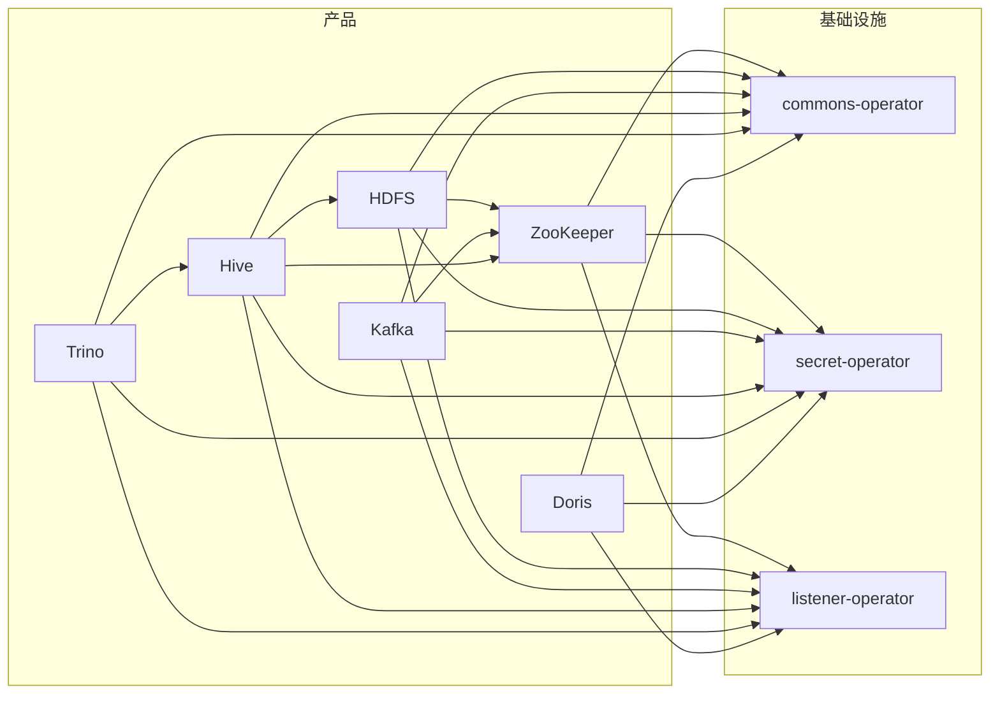
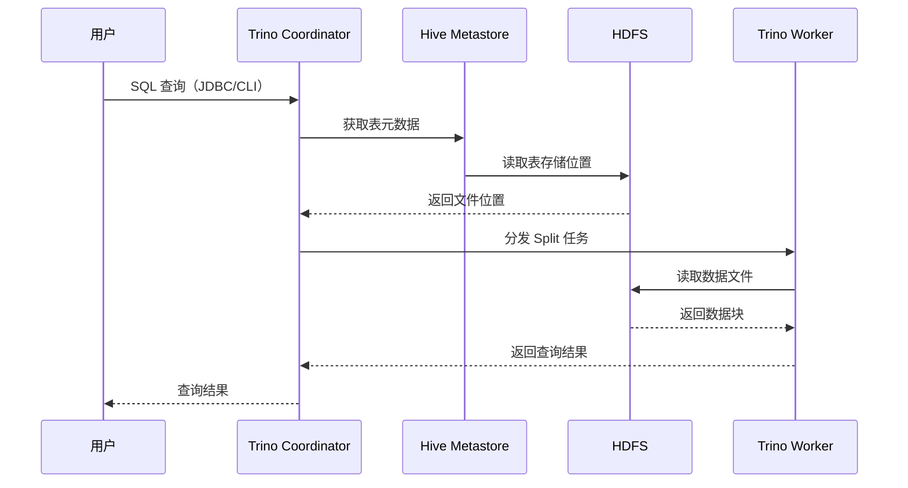

# 架构

本文档提供 Kubedoop 数据平台的架构概览，包括组件关系、数据流和设计原则。

## 整体架构



## 组件概览

### 基础设施 Operator

这些 Operator 为所有产品 Operator 提供共享能力：

| Operator | 用途 | 核心资源 |
|----------|------|---------|
| **commons-operator** | 平台共享 CRD 定义 | `AuthenticationClass`、数据库连接 |
| **secret-operator** | 为 Pod 置备和注入 TLS 证书及密钥 | TLS 证书、Kerberos keytab、密码 |
| **listener-operator** | 管理网络监听器和负载均衡器 | `ListenerClass`、`PodListeners` |

### 产品 Operator

每个产品 Operator 负责管理特定数据组件的完整生命周期：

| 分类 | Operator |
|------|----------|
| **存储** | HDFS、Doris |
| **消息队列** | Kafka |
| **查询引擎** | Trino、Hive、Spark、Kyuubi |
| **任务编排** | Airflow、DolphinScheduler |
| **数据集成** | NiFi |
| **可视化** | Superset |
| **协调服务** | ZooKeeper |

## 依赖关系

### Operator 依赖



**所有产品 Operator** 都依赖 commons-operator、secret-operator 和 listener-operator。

此外，部分产品之间存在运行时依赖：
- **Kafka**、**Hive**、**HBase** 需要 **ZooKeeper**
- **Hive** 需要 **HDFS**（或兼容存储）
- **Trino** 可以连接 **Hive**（Hive Catalog）和 **Kafka**（流式查询）

## 数据流示例

以下图表展示了使用 Hive + Trino 进行交互式查询的典型数据流：



### 服务发现

Kubedoop 使用 **服务发现 ConfigMap** 模式实现组件间通信：
- 每个产品创建一个与集群实例同名的 ConfigMap
- ConfigMap 包含连接详情（主机名、端口、凭据引用）
- 其他 Operator 读取此 ConfigMap 来配置连接

这种方式避免了硬编码地址，支持动态重新配置。

## operator-go 框架

所有 Kubedoop Operator 都基于 [operator-go](https://github.com/zncdatadev/operator-go) 框架构建，该框架提供：

### 架构层次

```
┌─────────────────────────────────────────────────┐
│              产品 Operator                       │
│  ┌───────────────────────────────────────────┐  │
│  │           operator-go 框架                 │  │
│  │  • GenericReconciler（模板方法模式）      │  │
│  │  • 扩展系统（集群/角色/角色组）           │  │
│  │  • 资源构建器（STS/SVC/CM/PDB）           │  │
│  │  • 配置生成（XML/YAML/Properties/Env）     │  │
│  │  • Sidecar 管理（Vector/JMX Exporter）    │  │
│  │  • CRD API（认证/数据库/监听器/S3）        │  │
│  └───────────────────────────────────────────┘  │
│  ┌───────────────────────────────────────────┐  │
│  │       controller-runtime（K8s sigs）       │  │
│  └───────────────────────────────────────────┘  │
└─────────────────────────────────────────────────┘
```

### 核心概念

- **GenericReconciler**：使用模板方法模式实现调谐循环。产品 Operator 提供角色特定的处理器。
- **扩展系统**：在三个层级提供基于 Hook 的自定义能力：
  - *集群级别*：应用于所有角色的全局设置
  - *角色级别*：应用于特定角色的设置（如所有 Kafka Broker）
  - *角色组级别*：应用于特定角色组的设置（如 "高内存" Broker 组）
- **资源构建器**：用于构建 Kubernetes 资源（StatefulSet、Service、ConfigMap、PodDisruptionBudget）的流式 API
- **配置生成**：支持 XML、YAML、Properties 和环境变量的多格式配置文件生成

## 设计原则

### 1. 松耦合

各 Operator 独立运行，仅通过 Kubernetes 资源（CRD、ConfigMap、Secret）进行通信。没有 Operator 直接调用另一个 Operator 的 API。

### 2. 声明式配置

所有产品配置通过 YAML 自定义资源完成。用户描述*期望状态*，Operator 负责将该状态调谐为实际状态。

### 3. 角色与角色组

每个产品实例由**角色**（逻辑进程类型）组成，每个角色可进一步划分为**角色组**（可配置的副本）。该模型提供：
- 按进程类型的细粒度资源分配
- 按角色组的独立扩缩容和配置
- 通过角色组级别的更新实现渐进式发布

### 4. 统一抽象

公共关注点（TLS、认证、日志、资源管理）由基础设施 Operator 和 operator-go 框架处理。产品 Operator 专注于产品特定逻辑。

### 5. 平台可移植性

Kubedoop 可运行在任何 Kubernetes 1.26+ 集群上，包括托管服务（阿里云 ACK、腾讯云 TKE）、轻量级发行版（K3s、MicroK8s）以及本地部署。
